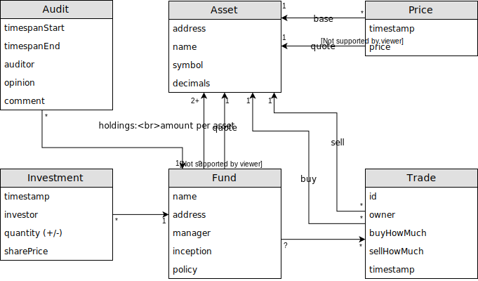
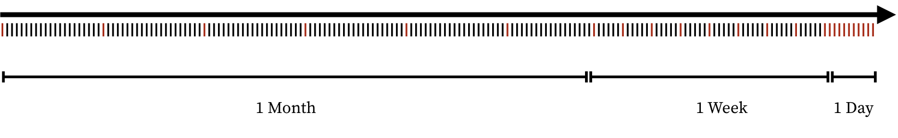

# Research

## Available data

The following ERM is a representation of the minimalistic data available on the blockchain of a fund to build charts and reports. All data can be derived from this model. It is still a challenge to obtain historical data (price feed history) since we need to search the blockchain for events. But this is subject to another chapter. For research purposes it is sufficient to know that this data is available.

### Explanation

* The fund is in the center. Once setup a fund cannot change its name/address/owner
* Every fund has one quote asset in which its value is denominated. Usually MLN.
* Total number of shares ($$ s $$) can be retrieved with the following formula:

  <!-- prettier-ignore -->
  $$
  s = \displaystyle\sum_{i \in I} q_i
  $$

  Where $$ I $$ is the set of all investments and $$ q_i $$ the quantity of shares per investment.

* AUM ($$ aum $$) can be retrieved with the following formula:

  <!-- prettier-ignore -->
  $$
  aum = \displaystyle\sum_{a \in A} h_a * p_a
  $$

  Where:

  * $$ A $$ is the set of all assets a fund is invested in
  * $$ h_a $$ the amount of holdings the fund has of asset $$ a $$
  * $$ p_a $$ the price of asset $$ a $$

* Shareprice ($$ sp $$):

  <!-- prettier-ignore -->
  $$
  sp = \frac{aum}{s}
  $$

## Data classifications

### Source

* **On-chain call**: Data can be retrieved from the blockchain directly by calling a function. _Examples_: current price, fund name, recent trades, ...
* **On-chain event**: Data can be retrieved from the blockchain by searching for events. This data cannot be used by smart contracts. I.e. a smart contract cannot check if a certain event happened. _Examples_: Price history
* **Off-chain**: Data that is not retrievable from the blockchain.
* **Static**: Once written this data does not change anymore. _Examples_: Fund name, ...
* **Generated**: Data that is generated automatically. _Examples_: Address, indexes, ...
* **Live**: Data that can change frequently. _Examples_: Prices, orderbook, AUM, ...
* **Archive**: List data that stays once written. Archive data can be consolidated for display purposes but needs to be preserved. _Examples_: Trade history, participation history, ...
* **Historic**: List data that stays once written but it's importance/density lessens with age: _Examples_: Price history; It is important to know the exact price for every minute for the last 24h but older prices can be store in less density, e.g every hour. The older the lesser the density.
  
  _Red lines: saved data, black lines: available data_
* **Free text**: General text. Usually lawyer jargon.
* **Given**: Data that is given (and the same) by a template/recommendation

### Difficulty to retrieve

* **Easy**: Data is directly available through a simple (API-) call. _Example_: Fund name
* **Complicated**: Data is available but we
* **Currently not possible**:

## SFAMA FINMA KIID Template (German)

The first document we look at is the SFAMA KIID template which is available on their website and acts as a general template to submit to FINMA:
{{"KIIDVorlageSFAMA2012"|cite}} pages 3-4.

### Praeamble

Prepended to every KIID document there is the following legal text:

> _Wesentliche Informationen für die Anlegerinnen und Anleger_: Gegenstand dieses Dokuments sind wesentliche Informationen für die Anlegerinnen und Anleger über diese kollektive Kapitalanlage. Es handelt sich nicht um Werbematerial. Diese Informationen sind gesetzlich vorgeschrieben, um Ihnen die Wesensart dieser kollektiven Kapitalanlage und die Risiken einer Anlage zu erläutern. Wir raten Ihnen zur Lektüre dieses Dokuments, sodass Sie eine fundierte Anlageentscheidung treffen können.

Which seems to be the same as in english KIID documents from EFAMA. Here in english:

> _Key information for investors_: This document provides key investor information about this collective investment scheme. It is not marketing material. The information is required by law to help investors understand the nature and the risks of investing in this Fund. Investors are advised to read it so to make an informed decision about whether to invest.

**Data classification**: off-chain, free text, given

### Fund name

The long name of the fund. E.g. "Credit Suisse (CH) Small Cap Switzerland Equity Fund"

**Data classification**: on-chain, free text

### ID/ISIN

The funds ISIN. For us this can be the address of the deployed fund contract if fund is not submitted to isin.org.

**Data classification**: on-chain, generated

### Objectives and investment policy

_german_: Anlageziele und Anlagepolitik

In this section we have two different contents:

### Objectives

Free text about the goals and strategy of the fund:

* Main categories
*

**Data classification**: off-chain, free text

### Policy

Aside from the free text, there is some structured information about different fund policies which may be implemented as smart contracts:

#### Participation policy

Generally, Melon funds do not restrict investors from withdrawing funds or termination. But every fund can have a separate Participation/compliance module (see [Melon smart-contracts: ComplianceInterface](https://github.com/melonproject/smart-contracts/blob/v0.7.2-alpha.1/src/compliance/ComplianceInterface.sol#L6)) which can restrict investing & redemption through boolean functions with the following inputs: `investor`, `shareQuantity`, `giveQuantity`. The redemption of shares is also restricted if the fund does not hold enough of the quote asset (i.e. cash, e.g. ETH). That said, it is always possible to redeem in slices.

**Data classification**: on-chain, policy

## Other

http://www.fundinfo.com/en/home/

https://www2.deloitte.com/content/dam/Deloitte/lu/Documents/financial-services/IM/lu_priips-key-investor-document.pdf

## Example #1 FTIF - Templeton Global Total Return Fund - A

* http://www.fundinfo.com/en/isin/LU0170475312/
* [KIID](https://api.fundinfo.com/document/922690308db83cc5533c7b98f58ab566_95685/KID_CH_en_LU0170475312_YES_2018-01-26.pdf?apiKey=cac544c04981213bf5682b140b4a8c99)

## EFAMA

* [European PRIIPs Template (EPT)](http://www.efama.org/documents/20171006-EPT-V1.1.xlsx)
* [“Comfort” EPT (CEPT)](http://www.efama.org/documents/20171006-CEPT-V1.1.xls)

## KIID

https://www.sfama.ch/de/selbstregulierung-musterdokumente/fondsverwaltung/verfuegbare-dokumente?set_language=de

https://www.pwc.ch/en/publications/2016/collective_investment_en.pdf
